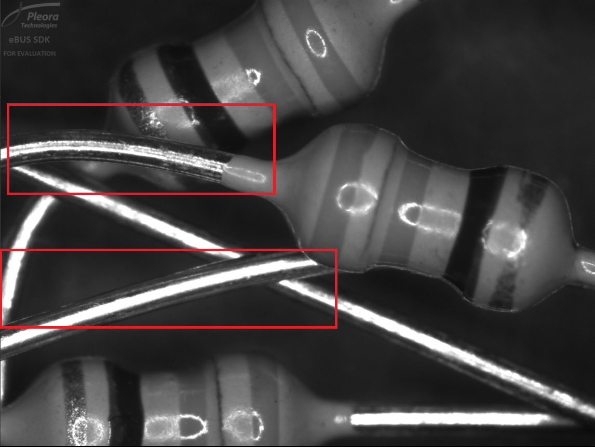
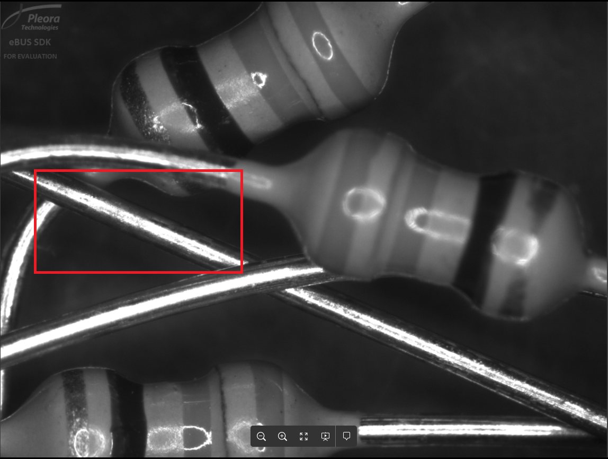
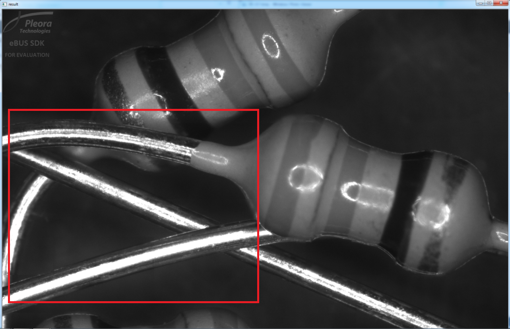
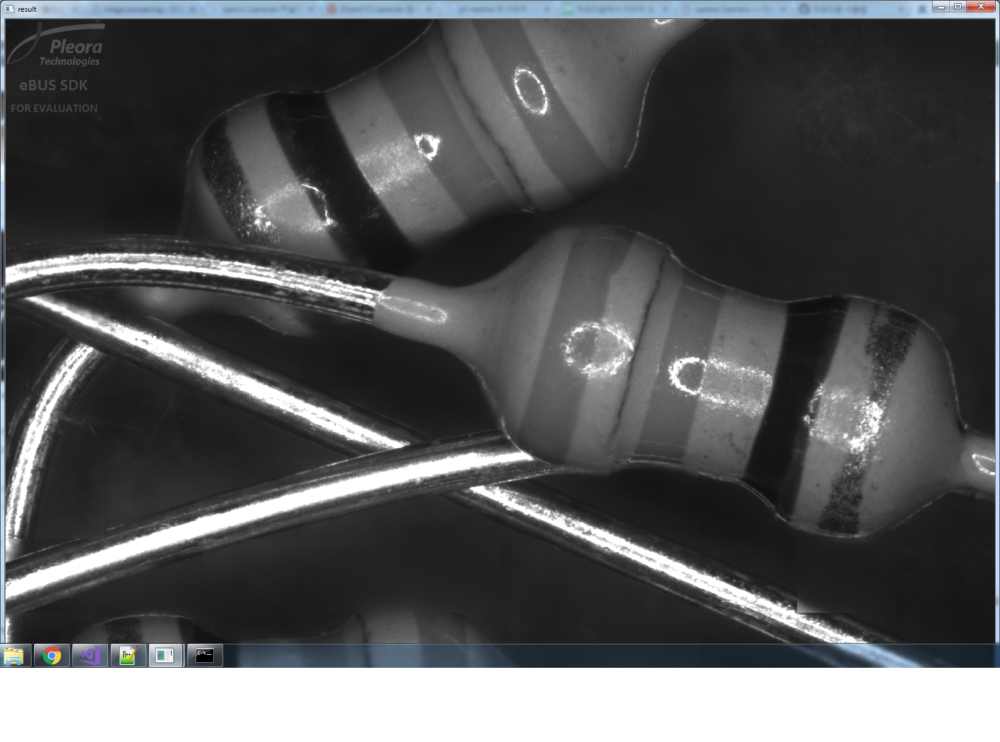

# MergeBySharpness

개발환경

c/c++

visualstudio 2017

opencv 310

sobel

이미지 1

앞쪽이 좀 더 선명함

이미지 2

뒤쪽이 좀 더 선명함

결과

두부분 모두 선명함

추가
이미지 2개에서 폴더내 모든 이미지로 확장하였음

현재 총 11개의 이미지가 있고 이 이미지들을 모두 분석하여

가장 선명한 부분만 가져오도록 했음

sobel과 laplace 각각 사용할 수 있도록 구현했고,

아래는 laplace 사용시 결과

결과이미지

